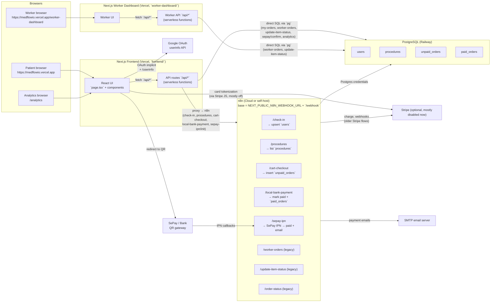
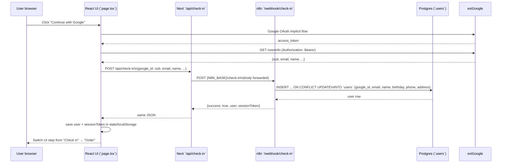
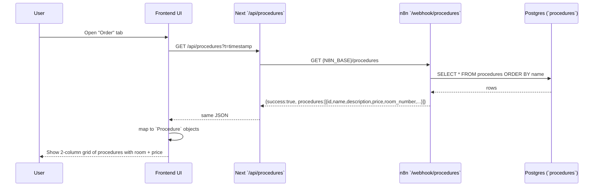
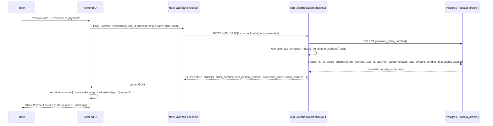
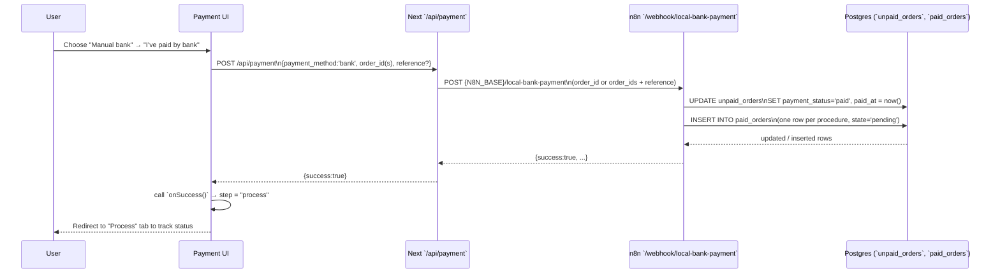
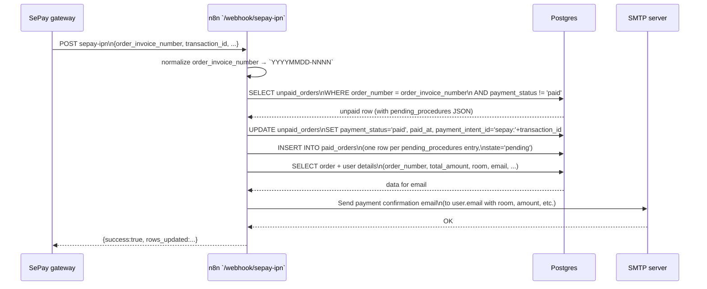
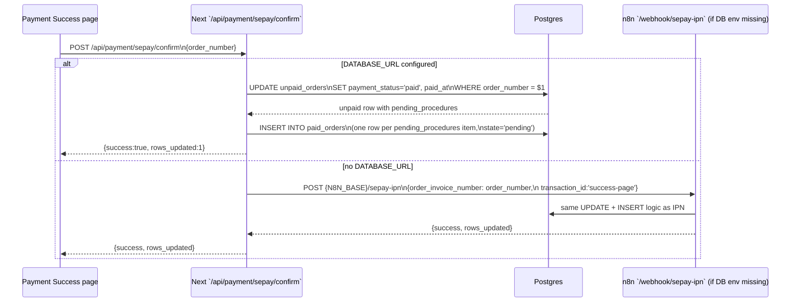
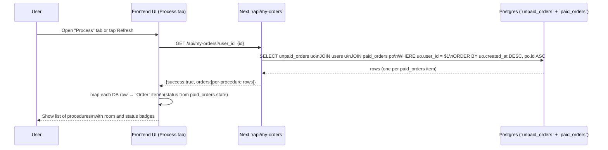
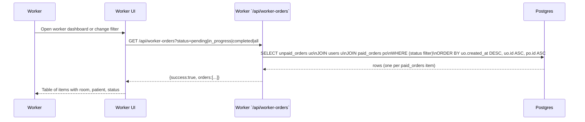
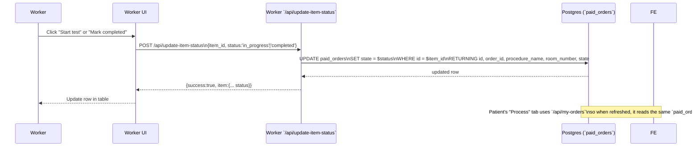

## MedFlow Architecture & Flows

This document describes how the MedFlow system works end to end: how the frontend and worker dashboard talk to Next.js API routes, how those proxy to n8n webhooks, and how everything persists data in PostgreSQL.

---

## 1. High-level architecture

---

## 2. Flow – Check-in & user creation

Code locations:
- UI: `frontend/src/app/page.tsx`, `frontend/src/components/CheckIn.tsx`
- API: `frontend/src/app/api/check-in/route.ts`
- n8n: `n8n-workflows/check-in.json`

---

## 3. Flow – Procedure listing & cart checkout (creates `unpaid_orders`)

### 3.1 Load procedure list

### 3.2 Cart checkout → `unpaid_orders` via n8n

Code locations:
- UI: `frontend/src/components/ProcedureSelection.tsx`
- APIs: `frontend/src/app/api/procedures/route.ts`, `frontend/src/app/api/cart-checkout/route.ts`
- n8n: `n8n-workflows/procedure-selection.json`, `n8n-workflows/cart-checkout.json`

---

## 4. Flow – Payments (manual bank + SePay)

### 4.1 Manual bank payment via n8n `local-bank-payment`

### 4.2 SePay QR – IPN via n8n + fallback confirm route

Primary IPN path:

Fallback success-page confirm route:

Code locations:
- UI: `frontend/src/components/Payment.tsx`, payment success page
- APIs: `frontend/src/app/api/payment/route.ts`, `frontend/src/app/api/payment/sepay/confirm/route.ts`, SePay init route
- n8n: `n8n-workflows/local-bank-payment.json`, `n8n-workflows/sepay-ipn.json`

---

## 5. Flow – Patient "Process" tab (my orders)

Code locations:
- UI: `frontend/src/app/page.tsx` (step `'process'`), `frontend/src/components/OrderStatus.tsx`
- API: `frontend/src/app/api/my-orders/route.ts`

---

## 6. Flow – Worker dashboard list & status updates

### 6.1 Worker sees queue of procedures

### 6.2 Worker updates a procedure item’s status

Code locations:
- UI: `worker-dashboard/src/app/page.tsx`, `worker-dashboard/src/components/OrderList.tsx`
- APIs (worker app): `worker-dashboard/src/app/api/worker-orders/route.ts`, `worker-dashboard/src/app/api/update-item-status/route.ts`
- APIs (main app mirrors): `frontend/src/app/api/worker-orders/route.ts`, `frontend/src/app/api/update-item-status/route.ts`
- n8n equivalents: `n8n-workflows/worker-orders.json`, `n8n-workflows/update-item-status.json`

